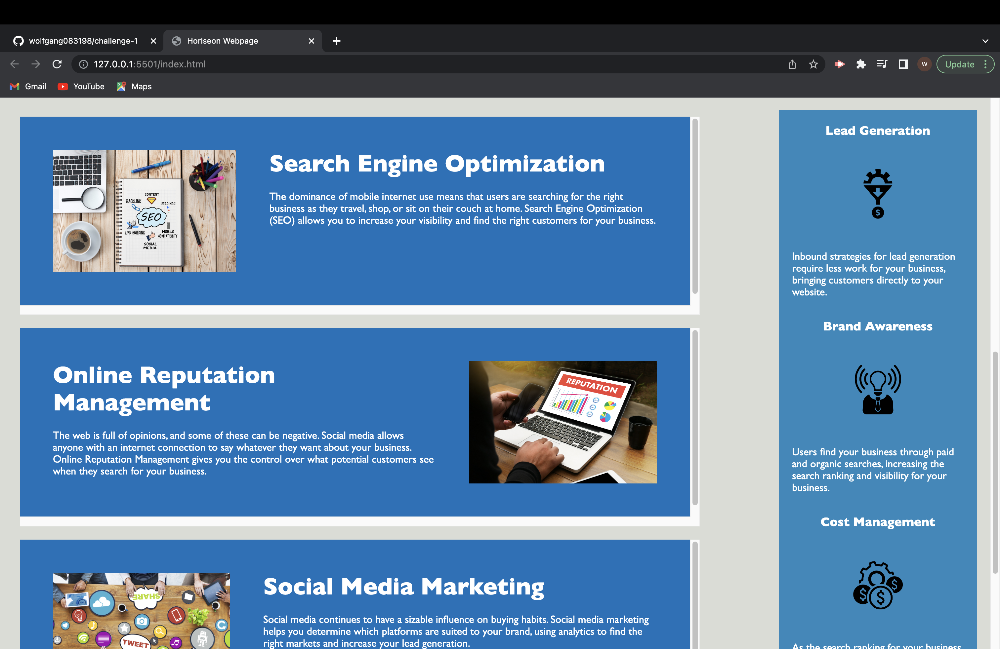

# challenge-1 Horiseon Webpage

## Description

During this project I was was motivated by help make changes to the CSS page and the HTML page that away that webpage was able to stay organized even on a smaller screen. I was able to solve the problem of the words overflowing onto the next div or section and creating kind of a hard way to read the text. While I was doing this project I was able to learn more about what you can do inside your CSS page!

## Installation
N/A

## Usage

When using this webpage you will see that even when you shrink the webpage the content inside of the div tags are now scrollable and not overflowing or overlapping onto the next topic. You can also click on 1 of the 3 options on the top of the page in order to navigate to that topic.

 

## Credits
In this project I used https://www.youtube.com/watch?v=kGA9RIFiyIE .
I also was able to use notes from a coding app called "Mimo" that I study outside of class. https://apps.apple.com/us/app/mimo-learn-coding-programming/id1133960732 .

## License
N/A